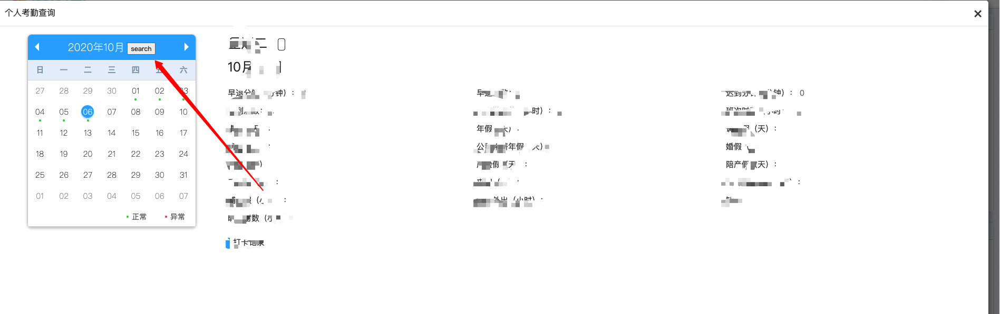
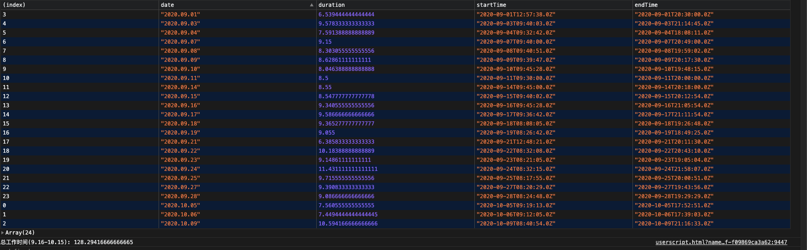
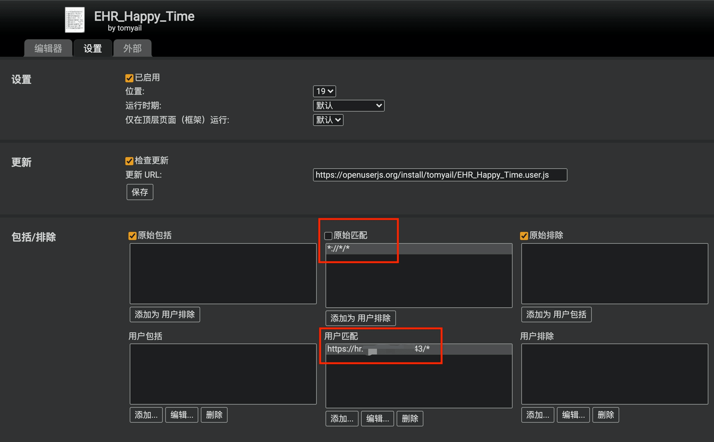

# 获取 E_HR 系统的每天工作时间的油猴脚本

## 主要功能

- 登陆 ehr 后,支持自动获取当月的考勤记录
- 支持直接在日历视图上显示加班时间
- 在查询完毕后会缓存结果,不用每次都查询
- 自动存储考勤周期和配置,刷新后数据依然存在
- 支持自定义工作时间和请假时间
- 支持剩余工作预测和考勤统计

## 如何使用

1. 安装 [tampermonkey](https://www.tampermonkey.net/) 插件
2. [安装用户脚本](https://openuserjs.org/install/tomyail/EHR_Happy_Time.user.js)
3. 打开 E_HR 系统,进入个人考勤查询系统. 点击 "Search" 按钮 脚本将会自动查询并在 [开发者工具上](https://developers.google.com/web/tools/chrome-devtools/console) 打印 **当月** 每天的上班时间
4. 后续只要查询过有缓存数据,即使没有登录,只要在开发者工具发现`脚本已注册完毕`,依然可以获得历史统计数据



### 在查询到每天的工作时间后,可以查询指定时间段的总工作时间

在开发者工具上运行如下脚本:

```javascript
// 查询所有日期的总工作时间
__ehr_summary();

// 查询特定范围的总工作时间(查询 9/15- 10/15 的总上班时间)

__ehr_summary('9.15', '10.15'); //9.15, '10.15' 会在查询后记住
```

## 更新请假时间

在开发者工具上运行如下脚本:

```javascript
__ehr_set_absentHour('11.1', 4); //设置 11/4 号请假 4 小时
```

### 最终效果图



## F&Q

- 为什么 \_\_ehr_summary 获取过来的时间加班时间不对

一种意料中的情况是你 `Search` 了 9 月的加班时间,但是没有 `Search` 10 月的时间, 这个时候你如果希望获得 `__ehr_summary('9.15', '10.15');` 的时间是不可能的,请先将日历翻到 10 月,然后点 `Search`

如果不是这种情况,欢迎提 issue

- 为什么运行了一次之后 console 没有每天的数据了

由于查询相同的日期获取到的打卡时间都是不变的,所以脚本在一次执行后会把计算结果存储到 localstorage 上面,key 为 `__ehr_cache`, 当脚本发现指定日期已经查询过后,会跳过这一天的查询.

你可以通过调用如下方法清除 缓存

```javascript
__ehr_clearCache();
```

- 上班规则是什么?

中午:12:00- 13:00; 晚上:18:30- 19:30 不算上班时间

- 可以禁用缓存吗?

自行修改脚本,将 `window.happyTime.runForEHR(false, cache)` 修改为 `window.happyTime.runForEHR(false,{})`

- 可以调整上班规则吗?

请参考如下代码自行修改

```javascript
window.happyTime.runForEHR(false, cache, [
  //h:mm
  ['11:30', '12:30'],
  ['18:30', '19:30'],
]);
```

- 只看每天工作时间不够,我能拓展脚本吗?

```javascript
interface ParsedData {
  //打卡时间
  active: Date[];
  //有效的上班时间段,是个数组,其中每个对象的数据结构为 {s:number,e:number}. 表示时间段的时间戳
  intervals: (Interval | null)[];
  //日期
  date: Date;
  //日历 dom (内部使用)
  ele: Element;
  //外部修改的加班时间,黑科技,暂不开放
  overrideDuration?: number;
}

window.happyTime.runForEHR(false, false, cache).subscribe(
  //每天的计算回调,x 为每天的工作数据
  (x: ParsedData) => console.log(x),
  //错误回调,一旦发生,脚本停止(x 为错误)
  (x) => console.error(x),
  //当全部日期计算完后回调
  () => {
    localStorage.setItem('__ehr_cache', JSON.stringify(cache));
  }
);
```

- 不想脚本在任何网站都执行怎么办？

点击tampermonkey插件，打开管理面板，找到EHR_Happy_Time，点右边的编辑按钮，按下图设置，填入ehr系统的网址



